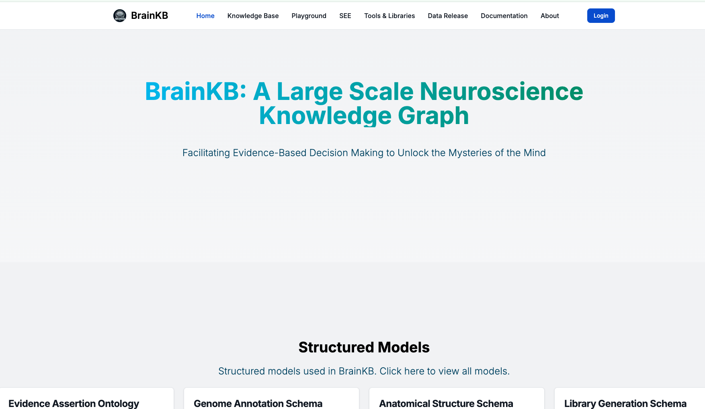
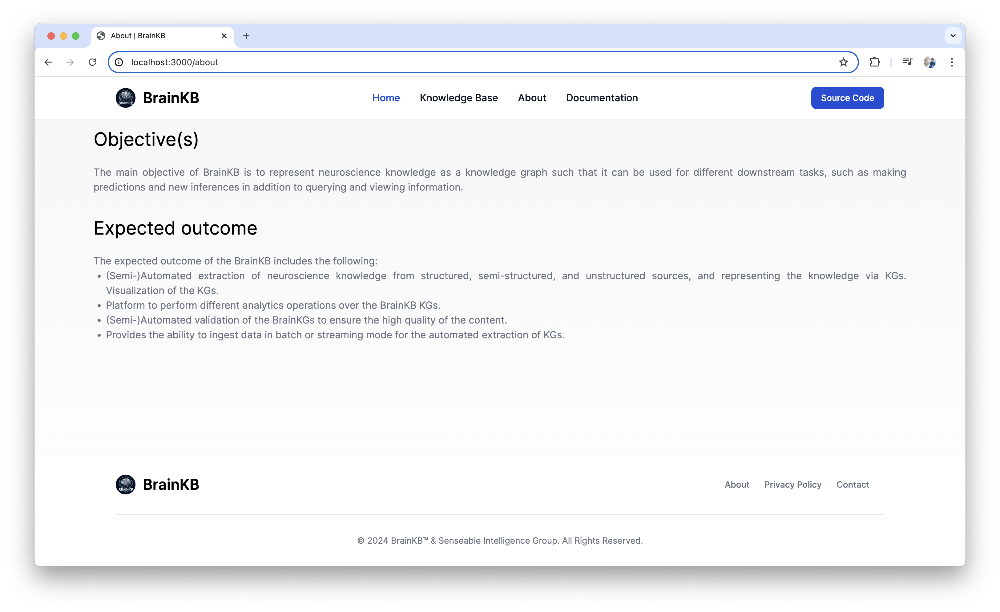
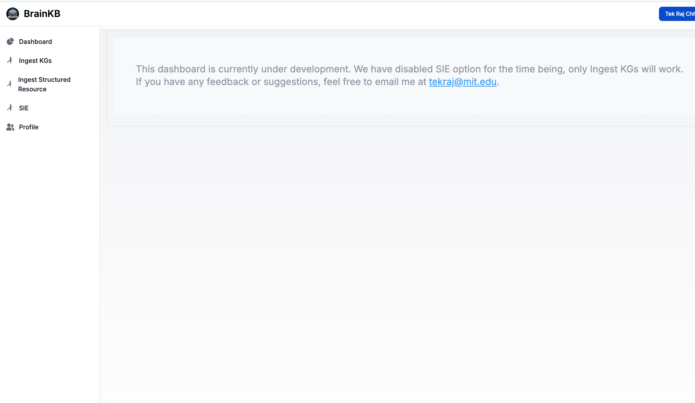

# 🧠 BrainKB UI

A modern user interface for exploring and interacting with the **BrainKB Knowledge Graph infrastructure**.  

---

## 📸 Screenshots

| Home | About | Admin |
|------|-------|-------|
|  |  |  |

---

## Getting Started

You can run BrainKB UI locally or with Docker.  
The UI depends on the **BrainKB backend services** (authentication, query, chat, etc.).   

---

### 1. Clone the Repository & Configure Environment

```bash
git clone https://github.com/sensein/brainkb-ui.git
```

Before starting the app, create a `.env.local` file with the required environment variables.

---

### 🧠 Environment Variables

Below is a structured overview of supported variables:


```env
########################################################################################################
######### OAuth Credentials (Optional) ###############################################################
# Required only if you want to enable login via GitHub or access the admin dashboard.
# ORCID login is not supported in local development.
########################################################################################################
GITHUB_CLIENT_ID=APP-XXXXXXXXX
GITHUB_CLIENT_SECRET=XXXXXX

ORCID_CLIENT_ID=APP-XXXXXX
ORCID_CLIENT_SECRET=XXXXXXXX

NEXTAUTH_SECRET=ANY_RANDOM_STRING_SECRET
NEXTAUTH_URL=http://localhost:3000 #FOR LOCAL DEPLOYMENT


########################################################################################################
######### Structured Resource Extraction ##############################################################
# Endpoints for uploading and saving structured resources.
########################################################################################################

NEXT_PUBLIC_API_ADMIN_EXTRACT_STRUCTURED_RESOURCE_ENDPOINT=http://127.0.0.1:8007/api/structured-resource-extraction
NEXT_PUBLIC_API_ADMIN_SAVE_STRUCTURED_RESOURCE_ENDPOINT=http://127.0.0.1:8007/api/save/structured-resource

########################################################################################################
######### JWT Authentication ##########################################################################
# Common JWT credentials for accessing backend services.
########################################################################################################

NEXT_PUBLIC_JWT_USER=XXXXXXXX
NEXT_PUBLIC_JWT_PASSWORD=XXXXXXX

########################################################################################################
######### User Profile Management #####################################################################
# Endpoints for creating, fetching, and updating user profiles.
########################################################################################################

NEXT_PUBLIC_TOKEN_ENDPOINT_USER_MANAGEMENT_SERVICE=http://127.0.0.1:8007/api/token
NEXT_PUBLIC_CREATE_USER_PROFILE_ENDPOINT_USER_MANAGEMENT_SERVICE=http://127.0.0.1:8007/api/users/profile
NEXT_PUBLIC_GET_ENDPOINT_USER_PROFILE_USER_MANAGEMENT_SERVICE=http://127.0.0.1:8007/api/users/profile
NEXT_PUBLIC_UPDATE_ENDPOINT_USER_PROFILE_USER_MANAGEMENT_SERVICE=http://127.0.0.1:8007/api/users/profile
NEXT_PUBLIC_GET_ENDPOINT_USER_ACTIVITY_USER_MANAGEMENT_SERVICE=

########################################################################################################
######### Chat Service #################################################################################
# Endpoints for chat-related token generation and message streaming.
########################################################################################################

NEXT_PUBLIC_TOKEN_ENDPOINT_CHAT_SERVICE=http://127.0.0.1:8007/api/token
NEXT_PUBLIC_CHAT_SERVICE_API_ENDPOINT=http://127.0.0.1:8011/api/chat?stream=false

########################################################################################################
######### Query Service ################################################################################
# Endpoints for querying the Knowledge Graph and uploading triples.
########################################################################################################

NEXT_PUBLIC_TOKEN_ENDPOINT_QUERY_SERVICE=http://127.0.0.1:8010/token

# Query registered named graphs
NEXT_PUBLIC_API_NAMED_GRAPH_QUERY_ENDPOINT=http://127.0.0.1:8010/query/registered-named-graphs

# SPARQL query endpoint (used for querying knowledge graph)
NEXT_PUBLIC_API_QUERY_ENDPOINT=http://127.0.0.1:8010/query/sparql/

# Upload RDF/TTL/JSON-LD files representing Knowledge Graph triples
NEXT_PUBLIC_API_ADMIN_INSERT_KGS_JSONLD_TTL_ENDPOINT=http://127.0.0.1:8010/insert/files/knowledge-graph-triples
```

---

> **Note:**  
> To use the public BrainKB instance, register for a JWT key here:  
> [API Registration](https://ingest.brainkb.org/docs#/Security/register_api_register_post)  
> Your account must be **activated by an admin** before access is granted.  

---

### 2. Run Without Docker

1. Install [Node.js](https://nodejs.org/)  
2. Install dependencies:  
   ```bash
   npm install --legacy-peer-deps
   ```
   _(use `--force` if necessary)_  
3. Start development server:  
   ```bash
   npm run dev
   ```
   Note for production, you would run the following command.
   ```bash
   npm run build
   npm start
    ```
---

### 3. Run With Docker

To clean volumes and deploy in Docker, run:

```bash
bash clean_and_deploy.sh
```

Once deployed, open [http://localhost:3000](http://localhost:3000) in your browser.

---
 
