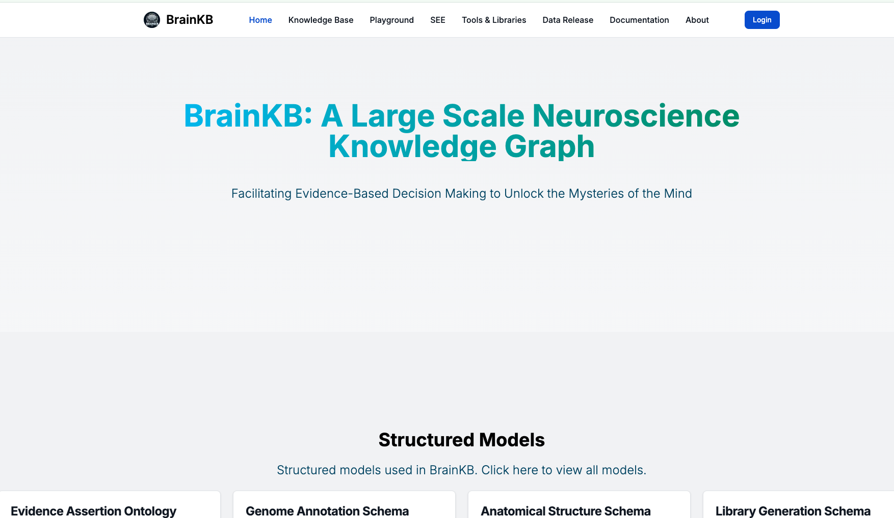
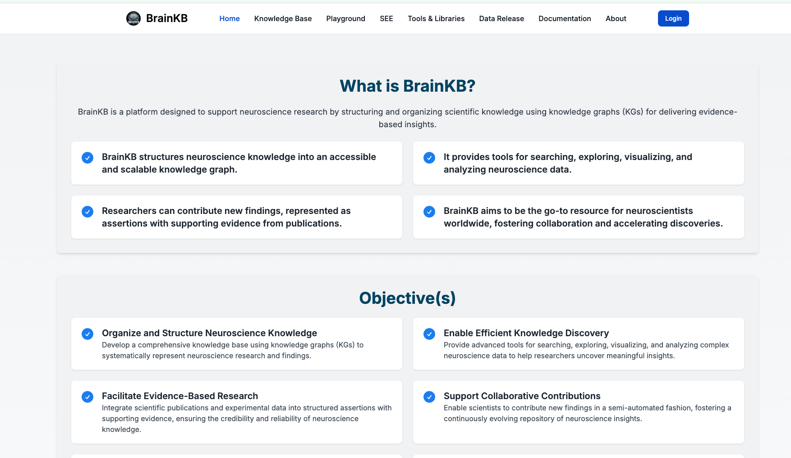
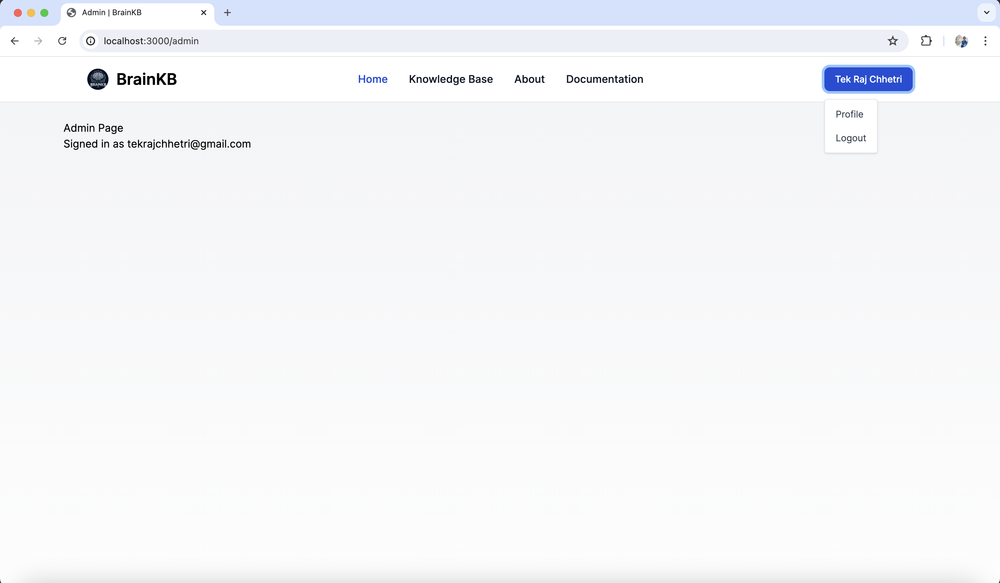

# 🧠 BrainKB UI

A user interface for interacting with the BrainKB knowledge graph infrastructure.

---

## 📸 Screenshots
| Home | About | Admin |
|------|-------|-----|
|  |  |  |

---

## 🚀 Directory 
- `nextjsUIapp` --> BrainKB UI and instructions.
- `old_kept_for_reference/djangoUImanager` --> Obsolete and can be ignored. It's kept there just for reference.
- `nextjsUIapp/ohbm-hackathon` --> Task for OHBM hackathon.

## 📄 License

This project is licensed under the [MIT License](LICENSE).
 
