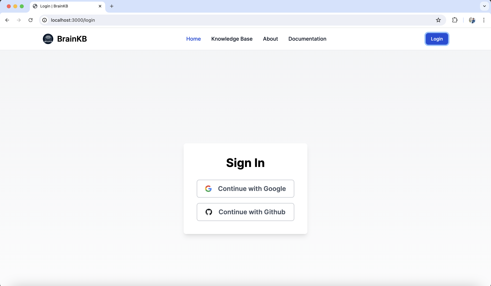

# BrainKB UI

## Getting Started

## Features
- Github and Google based authentication
    
    

# Running
For configuration and deployment, please see instructions at [https://sensein.group/brainkbdocs/deployment_userinterface.html](https://sensein.group/brainkbdocs/deployment_userinterface.html).

## License
MIT
