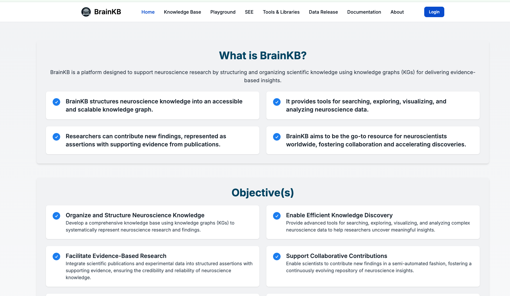

# BrainKB UI 

For configuration and deployment, please see instructions at [https://sensein.group/brainkbdocs/deployment_userinterface.html](https://sensein.group/brainkbdocs/deployment_userinterface.html).





## Getting Started

## Features
- Github and Google based authentication
    
    

#Requirements
- Nextjs dependencies
- Google and Github OAuth setup for login
  - Update the OAuth details in .env file
First, run the development server:

```bash
npm run dev
# or
yarn dev
# or
pnpm dev
# or
bun dev
```

Open [http://localhost:3000](http://localhost:3000) with your browser to see the result.
 
## License
MIT
