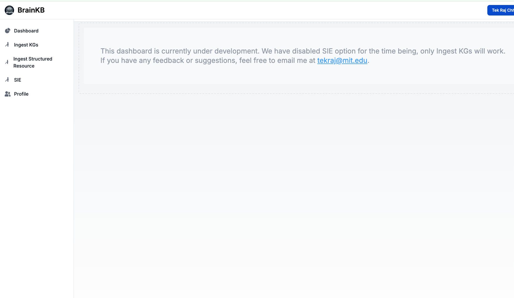

# 🧠 BrainKB UI

A user interface for interacting with the BrainKB knowledge graph infrastructure.

---

## 📸 Screenshots
| Home | About | Admin |
|------|-------|-----|
|  |  |  |

---

## 🚀 Getting Started

To deploy the BrainKB UI locally, follow these steps.

> ⚠️ Important Notes: These API configuration requires deployment of the BrainKB backend service. For more see [http://docs.brainkb.org/deployment_userinterface.html](http://docs.brainkb.org/deployment_userinterface.html).
> The document is old and might refer to different branch than main, ignore that and use the main branch.
### 1. Clone the Repository & Set Up Environment

```shell
git clone https://github.com/sensein/brainkb-ui.git
cd nextjsUIapp
```

Before deployment, create and configure a `.env.local` file. Most required environment variables are documented [here](http://docs.brainkb.org/deployment_userinterface.html), but note that recent updates might not yet be reflected there.

#### 🧠 API Configuration
```env
########################################################################################################
######### OAuth Credentials (Optional) ###############################################################
# Required only if you want to enable login via GitHub or access the admin dashboard.
# ORCID login is not supported in local development.
########################################################################################################
GITHUB_CLIENT_ID=XXXXX
GITHUB_CLIENT_SECRET=XXXXX

# Random string for securing NextAuth sessions
NEXTAUTH_SECRET=ANY_RANDOM_STRING_SECRET
# URL for local deployment (adjust for production)
NEXTAUTH_URL=http://localhost:3000


########################################################################################################
######### Structured Resource Extraction ##############################################################
# Endpoints for uploading and saving structured resources.
########################################################################################################
NEXT_PUBLIC_API_ADMIN_EXTRACT_STRUCTURED_RESOURCE_ENDPOINT=http://127.0.0.1:8007/api/structured-resource-extraction
NEXT_PUBLIC_API_ADMIN_SAVE_STRUCTURED_RESOURCE_ENDPOINT=http://127.0.0.1:8007/api/save/structured-resource


########################################################################################################
######### JWT Authentication ##########################################################################
# Common JWT credentials for accessing backend services.
########################################################################################################
NEXT_PUBLIC_JWT_USER=XXXX
NEXT_PUBLIC_JWT_PASSWORD=XXXX


########################################################################################################
######### User Profile Management #####################################################################
# Endpoints for creating, fetching, and updating user profiles.
########################################################################################################
NEXT_PUBLIC_TOKEN_ENDPOINT_USER_MANAGEMENT_SERVICE=http://127.0.0.1:8007/api/token
NEXT_PUBLIC_CREATE_USER_PROFILE_ENDPOINT_USER_MANAGEMENT_SERVICE=http://127.0.0.1:8007/api/users/profile
NEXT_PUBLIC_GET_ENDPOINT_USER_PROFILE_USER_MANAGEMENT_SERVICE=http://127.0.0.1:8007/api/users/profile
NEXT_PUBLIC_UPDATE_ENDPOINT_USER_PROFILE_USER_MANAGEMENT_SERVICE=http://127.0.0.1:8007/api/users/profile
NEXT_PUBLIC_GET_ENDPOINT_USER_ACTIVITY_USER_MANAGEMENT_SERVICE=


########################################################################################################
######### Chat Service #################################################################################
# Endpoints for chat-related token generation and message streaming.
########################################################################################################
NEXT_PUBLIC_TOKEN_ENDPOINT_CHAT_SERVICE=http://127.0.0.1:8007/api/token
NEXT_PUBLIC_CHAT_SERVICE_API_ENDPOINT=http://127.0.0.1:8011/api/chat?stream=false


########################################################################################################
######### Query Service ################################################################################
# Endpoints for querying the Knowledge Graph and uploading triples.
########################################################################################################
NEXT_PUBLIC_TOKEN_ENDPOINT_QUERY_SERVICE=http://127.0.0.1:8010/token

# Query registered named graphs
NEXT_PUBLIC_API_NAMED_GRAPH_QUERY_ENDPOINT=http://127.0.0.1:8010/query/registered-named-graphs

# SPARQL query endpoint (Knowledge Graph querying)
NEXT_PUBLIC_API_QUERY_ENDPOINT=http://127.0.0.1:8010/query/sparql/

# Upload RDF/TTL/JSON-LD files representing Knowledge Graph triples
NEXT_PUBLIC_API_ADMIN_INSERT_KGS_JSONLD_TTL_ENDPOINT=http://127.0.0.1:8010/insert/files/knowledge-graph-triples

```

> **Note:**  
> To test with the deployed BrainKB instance, set `NEXT_PUBLIC_API_ADMIN_HOST` to `https://queryservice.brainkb.org`.  
> 
> You can register for a JWT-based API user at [https://ingest.brainkb.org/docs#/Security/register_api_register_post](https://ingest.brainkb.org/docs#/Security/register_api_register_post).  
> 
> **Important:** After registration, your account must be activated by an admin before you can start using the API.

### 2. Deploy without Docker
1. Install NodeJS
2. Navigate to `nextjsUIapp` and run `npm install --legacy-peer-deps` (or --force)
3. Run `npm run dev`
### 3. Deploy with Docker

Run the following command to clean existing Docker volumes and deploy:

```bash
bash clean_and_deploy.sh
```

Once deployed, open your browser and visit:  
[http://localhost:3000](http://localhost:3000)

---

## ⚠️ Important Notes

- Do **not** upgrade the Next.js version unless explicitly needed. Future versions may introduce breaking changes.
- Admin panel access may not fully work on `localhost` due to OAuth restrictions by some providers (like ORCID).
  - Just in case if you get following issue (check docker logs <container-id>) though it should not be the case as the code has been updated.

      ```shell
      2025-06-22 00:00:53 web-1  |   code: 'NO_SECRET'
      2025-06-22 00:00:53 web-1  | }
      2025-06-22 00:00:53 web-1  | Error: There is a problem with the server configuration. Check the server logs for more information.
      2025-06-22 00:00:53 web-1  |     at s (/app/.next/server/chunks/5609.js:25:19829)
      2025-06-22 00:00:53 web-1  |     at async x (/app/.next/server/chunks/8081.js:9:7184) {
      2025-06-22 00:00:53 web-1  |   digest: '279538222'
      2025-06-22 00:00:53 web-1  | }
      2025-06-22 00:00:53 web-1  | Error: There is a problem with the server configuration. Check the server logs for more information.
      2025-06-22 00:00:53 web-1  |     at s (/app/.next/server/chunks/5609.js:25:19829)
      2025-06-22 00:00:53 web-1  |     at async x (/app/.next/server/chunks/8081.js:9:7184) {
      2025-06-22 00:00:53 web-1  |   digest: '279538222'
      2025-06-22 00:00:53 web-1  | }
      ```
    create a .env file and update the docker. 
      ```shell
      NEXTAUTH_SECRET=ANY_RANDOM_STRING_SECRET
      NEXTAUTH_URL=http://localhost:3000 #FOR LOCAL DEPLOYMENT
      ```
---

## 📄 License

This project is licensed under the [MIT License](LICENSE).
