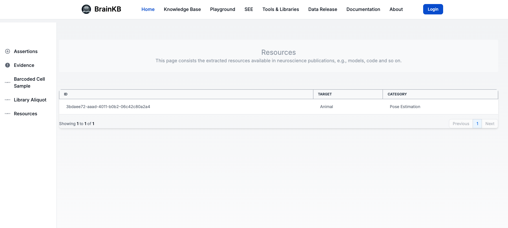
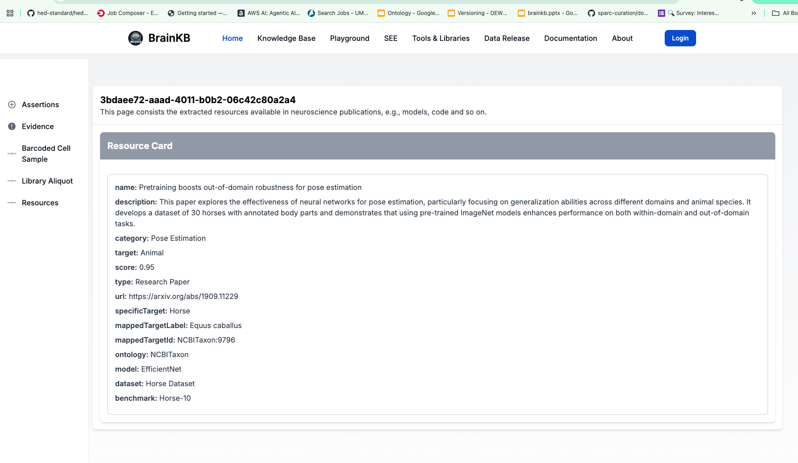
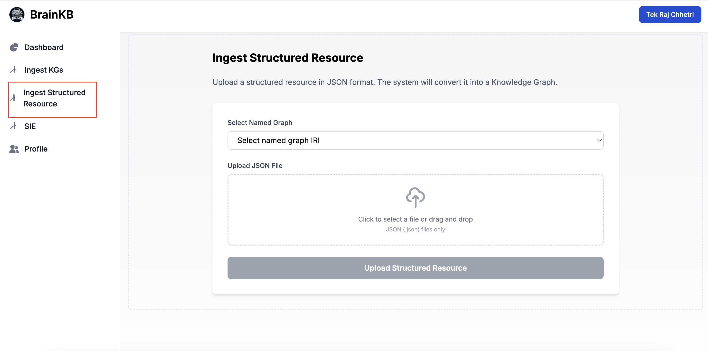

# 🧠 OHBM Hackathon: Configure an Entity Card View for Knowledge Bases

> ⚠️ Before starting task first make sure you are able to deploy (see `nextjsUIapp` directory) and run the BrainKB UI. Use the below `Credentials and Configuration`. 

In this task, you'll configure an **entity card view** to visualize structured resource data in the knowledge base.

By the end, you should achieve the following:

1. Clicking on the knowledge base will reveal `Resources` in the sidebar menu.

   

2. Clicking on a resource ID will open the entity card view:

   

---

## 🔐 Credentials and Configuration

To save time, we have provided a **GitHub token** that allows you to ingest data into the graph database. Please note that this token will be **disabled after the hackathon**.

> ⚠️ You also need a **JWT user and password**.  
> Ensure the password is enclosed in quotes and **escape special characters**.  
> Example: `"s522@#\$ohbm"`

```env
# OAuth Credentials
GITHUB_CLIENT_ID=Ov23limWWlLaXUVNUhJz
GITHUB_CLIENT_SECRET=7549c0660a0a1d91f539a2bc6945e53ac12d1350

# Auth Configuration
NEXTAUTH_SECRET="asff_hackathon@81_13w!ohbm"
NEXTAUTH_URL=http://localhost:3000

# API Configuration
NEXT_PUBLIC_API_ADMIN_HOST=https://queryservice.brainkb.org
NEXT_PUBLIC_API_QUERY_ENDPOINT=query/sparql
NEXT_PUBLIC_API_NAMED_GRAPH_QUERY_ENDPOINT=query/registered-named-graphs
NEXT_PUBLIC_API_ADMIN_INSERT_KGS_JSONLD_TTL_ENDPOINT=insert/files/knowledge-graph-triples
NEXT_PUBLIC_API_ADMIN_INSERT_STRUCTURED_JSON_ENDPOINT=insert/files/structured-resource-json-to-kg

# JWT User (will be provided)
NEXT_PUBLIC_JWT_USER=
NEXT_PUBLIC_JWT_PASSWORD=
NEXT_PUBLIC_TOKEN_ENDPOINT=https://queryservice.brainkb.org/token
```

---

## 📘 Data Source

You have **two options** for working with data in this task:

### ✅ Option 1: Use the Provided Data (Recommended)

The data we will be using for this task is the output of the StructSense multi-agent system for the resource extraction task.

- 🔗 **JSON Source**:  
  [resource_extraction/result.json](https://github.com/sensein/structsense/blob/main/example/OHBM/resource_extraction/result.json)
- 📥 This JSON was uploaded using the **"Ingest Structured Resource"** feature, which automatically:
  - Transforms the JSON into RDF triples
  - Inserts it into the graph database
- 📌 Named Graph IRI:
  ```shell
  https://brainkb.org/ohbm-australia/structured-resource/
  ```
<sub>Below: JSON ingest option → automatically generates knowledge graph triples</sub>

 
### 🛠 Option 2: Ingest Your Own Data

If you'd like to use your own structured resource JSON:
 
1. Log into the system  
2. Go to **"Ingest Structured Resource"**  
3. Select the following named graph IRI:
   ```shell
   https://brainkb.org/ohbm-australia/structured-resource/
   ```
4. Upload JSON and click on upload.

### 🛠 Option 2: Ingest Your Own KGs in JSON-LD or Turtle format
1. Log into the system  
2. Go to **"Ingest KGs"**  
3. Select the following named graph IRI:
   ```shell
   https://brainkb.org/ohbm-australia/
   ```
4. Upload KGs n JSON-LD or Turtle format and click on upload.
---

## 🛠️ Step-by-Step Instructions

You need to update **three YAML files** in `src/app/components/`.

---

### 1. `config-knowledgebases.yaml`

This file defines what appears in the sidebar under the knowledge base.

```yaml
- page: "Resources"
  title: "Resources"
  description: "This page lists resources extracted from neuroscience publications (e.g., models, datasets)."
  slug: "resource"
  sparql_query: |-
    PREFIX res: <https://brainkb.org/ohbm-australia/structured-resource/>

    SELECT ?id ?target ?category
    WHERE {
      GRAPH <https://brainkb.org/ohbm-australia/structured-resource/> {
        ?id res:target ?target ;
            res:category ?category .
      }
    }
  default_kb: false
  display_column_first: "id"
  display_column_second: "target"
  display_column_third: "category"
```

---

### 2. `entitycardmapper.yaml`

This file maps the slug to the entity card file.

```yaml
- card: resource_card
  slug: "resource"
  filename: "resource.yaml"
```

---

### 3. `resource.yaml`

This file defines the structure of the entity card view.

```yaml
id: ui:1
name: Resource_card
slug: resource
description: "This page displays detailed information about resources from neuroscience literature."

boxes:
  - box:
    slug: summarybox
    id: ui:2
    name: Resource Card
    cardtype: card
    box_header:
      key: id
    sparql_query: |-
      PREFIX res: <https://brainkb.org/ohbm-australia/structured-resource/>
      PREFIX xsd: <http://www.w3.org/2001/XMLSchema#>

      SELECT ?name ?description ?category ?target ?score ?type ?url
             ?specificTarget ?mappedTargetLabel ?mappedTargetId ?ontology
             ?model ?dataset ?benchmark
      WHERE {
        GRAPH <https://brainkb.org/ohbm-australia/structured-resource/> {
          ?resource
            res:name ?name ;
            res:description ?description ;
            res:category ?category ;
            res:target ?target ;
            res:judge_score ?score ;
            res:type ?type ;
            res:url ?url ;
            res:specific_target ?specificTarget ;
            res:mapped_specific_target_concept ?specificTargetURI ;
            res:mapped_target_concept ?mappedGeneralTarget ;
            res:mentions ?mentionURI .

          ?specificTargetURI
            res:specific_target ?specificTarget ;
            res:mapped_target_concept ?mappedTargetConcept .

          ?mappedTargetConcept
            res:label ?mappedTargetLabel ;
            res:id ?mappedTargetId ;
            res:ontology ?ontology .

          OPTIONAL { ?mentionURI res:models ?model }
          OPTIONAL { ?mentionURI res:datasets ?dataset }
          OPTIONAL { ?mentionURI res:benchmarks ?benchmark }

          FILTER (?resource = <{0}>)
        }
      }
```

> 🔄 `<{0}>` will be dynamically replaced by the resource ID from the URL query string.

---

## ✅ Done!

After successful configuration, navigating to the Resources page and clicking a resource ID should render the full entity card view.
